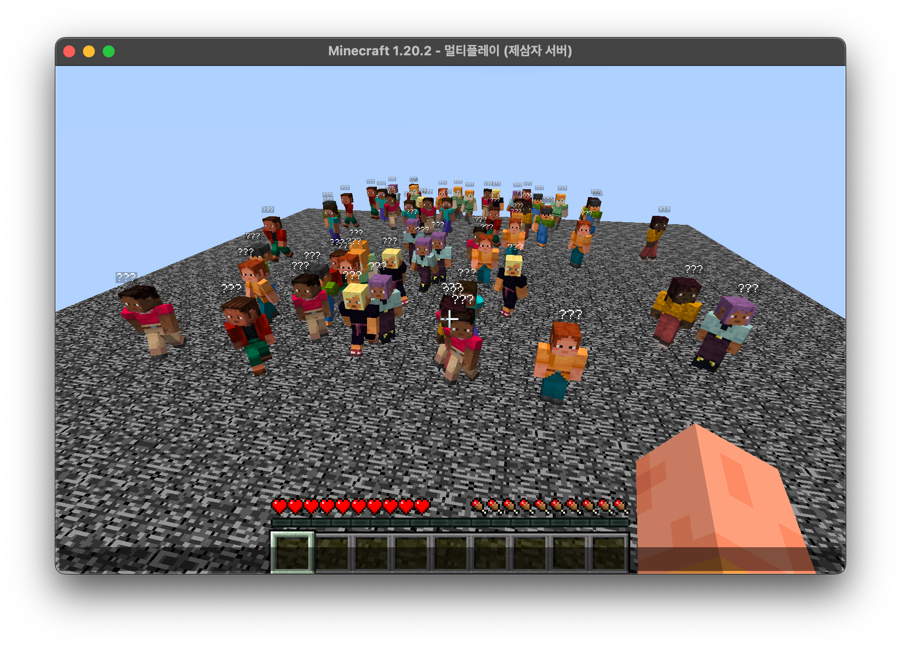

# Mintlin ~~(Min(ecraft) (Ko)tlin)~~

Mintlin is a Minecraft server fully written in Kotlin,
that aims to customize minigame server, being able to run itself without any of Mojang code. It is designed to dependency-less Java code. The project can be embedded as a library and also allows compiling code into multiplatform.

**Benchmark: The MacBook M1 can handle approximately 100 players moving every 1 tick.**

## Expected new scenarios

* Not depending on the JVM.
* AntiCheat implementation on the server.
* Various game protocol versions are supported, enabling users to connect across different versions.

[**join discord**](https://discord.gg/2KnEqH6JEH)
